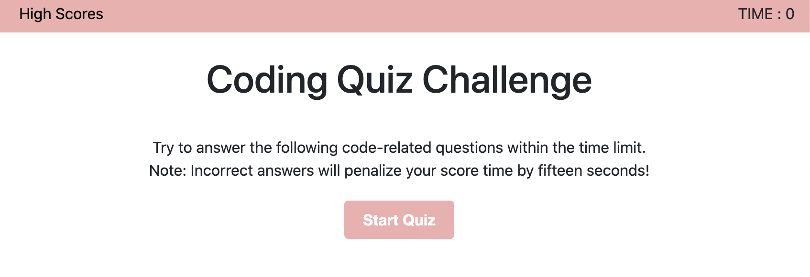

# HW-4_Web-Code-Quiz

This application is a timed code quiz with multiple-choice questions. This app runs in the browser and features dynamically updated HTML and CSS powered by my JavaScript code.

Check it out: https://yessyibarra.github.io/HW-4_Web-Code-Quiz-github.io/ 




## Acceptance Criteria

```
GIVEN I am taking a code quiz
WHEN I click the start button
THEN a timer starts and I am presented with a question
WHEN I answer a question
THEN I am presented with another question
WHEN I answer a question incorrectly
THEN time is subtracted from the clock
WHEN all questions are answered or the timer reaches 0
THEN the game is over
WHEN the game is over
THEN I can save my initials and score
